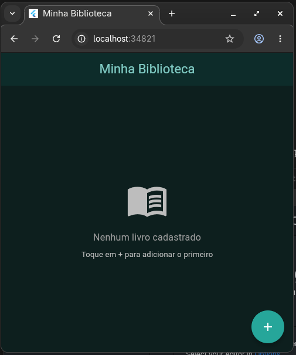
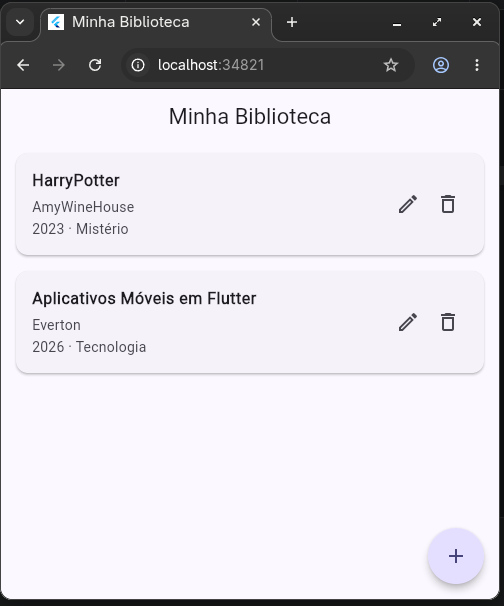
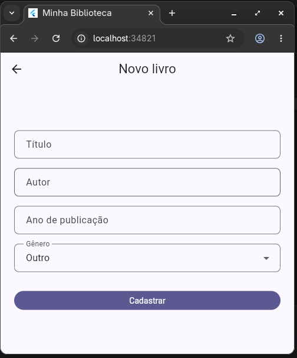
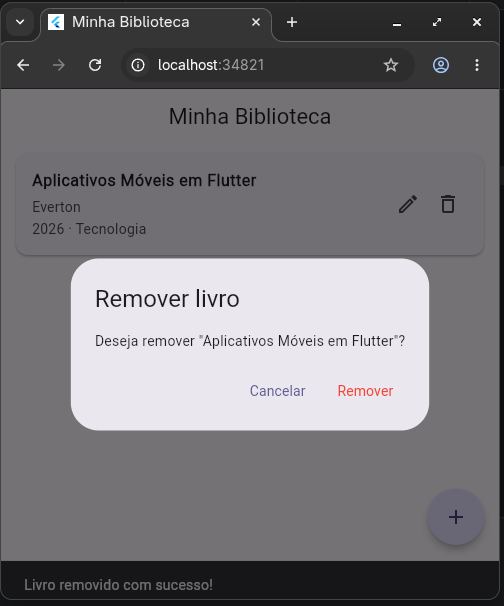

# 📚 Minha Biblioteca

Aplicativo Flutter desenvolvido como atividade de recuperação de frequência.
Permite gerenciar uma biblioteca pessoal com cadastro, edição e remoção de livros.

## 🎯 Tema e classe de negócio

A classe de negócio principal é a `Book`, que representa um livro da biblioteca
pessoal do usuário. Cada livro contém:

| Campo | Tipo | Descrição |
|---|---|---|
| `id` | `String` | Identificador único gerado via timestamp |
| `title` | `String` | Título do livro |
| `author` | `String` | Nome do autor |
| `publicationYear` | `int` | Ano de publicação |
| `genre` | `Genre` | Gênero literário (enum) |

## 🔄 Fluxo do CRUD

1. **Listagem** — ao abrir o app, a `ListPage` carrega automaticamente os livros
   salvos via `BookRepository.getAll()`. Se não houver livros, exibe o `EmptyState`
2. **Cadastro** — o botão `+` abre a `FormPage` sem parâmetros. Após preencher
   e salvar, o livro é persistido via `BookRepository.save()` e a lista é recarregada
3. **Edição** — ao tocar no ícone de editar de um card, a `FormPage` abre com os
   dados do livro pré-preenchidos. Ao salvar, chama `BookRepository.update()`
4. **Remoção** — ao tocar no ícone de remover, um `AlertDialog` solicita confirmação.
   Confirmado, chama `BookRepository.delete()` e exibe SnackBar de feedback

## 💾 Persistência local

Os dados são salvos com **SharedPreferences** em formato JSON. O fluxo é:

- **Salvar:** a lista de objetos `Book` é convertida com `toJson()` e serializada
  com `jsonEncode()`, depois gravada com `prefs.setString()`
- **Carregar:** a string JSON é recuperada com `prefs.getString()`, desserializada
  com `jsonDecode()` e cada item reconstruído com `Book.fromJson()`

## 🗂️ Estrutura de pastas

```
lib/
├── components/
│   ├── book_card.dart         # Card visual de um livro na listagem
│   └── empty_state.dart       # Widget exibido quando a lista está vazia
├── models/
│   └── book.dart              # Classe de modelo de negócio
├── pages/
│   ├── list_page.dart         # Tela inicial de listagem
│   └── form_page.dart         # Formulário de cadastro e edição
├── repositories/
│   └── book_repository.dart   # CRUD com persistência via SharedPreferences
├── utils/
│   └── genre.dart             # Enum de gêneros literários
└── main.dart                  # Ponto de entrada e ThemeData centralizado

docs/
└── ai/                        # Documentação do uso de IA
```

## ▶️ Como executar

### Pré-requisitos
- Flutter SDK instalado
- Emulador Android/iOS ou Chrome

### Passos

```bash
# 1. Clone o repositório
git clone https://github.com/alanlinoreis/minha_biblioteca.git

# 2. Acesse a pasta
cd minha_biblioteca

# 3. Instale as dependências
flutter pub get

# 4. Execute o app
flutter run
```

## 📸 Evidências de execução

### Listagem vazia


### Listagem com livros


### Formulário de cadastro


### Confirmação de remoção


## 🤖 Uso de IA

Este projeto foi desenvolvido com auxílio do Claude (Anthropic).
Todas as interações estão documentadas em [`docs/ai/`](./docs/ai/README.md).